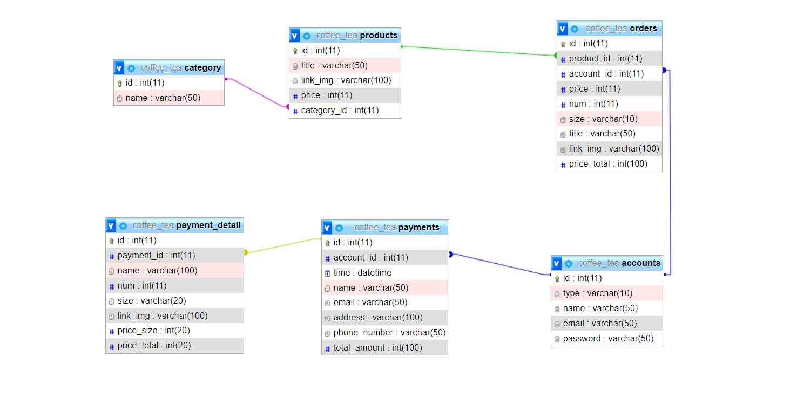
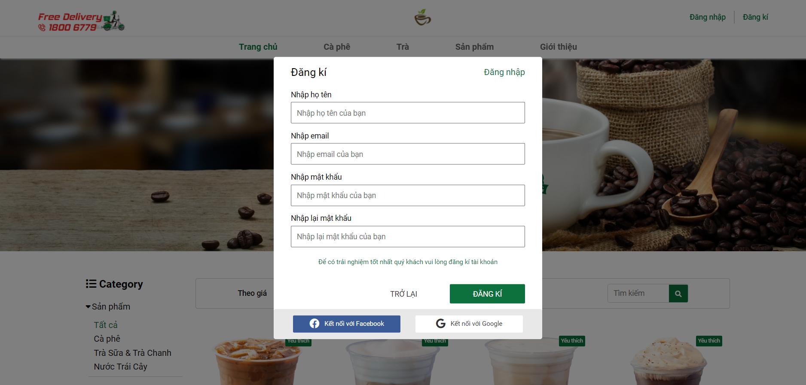
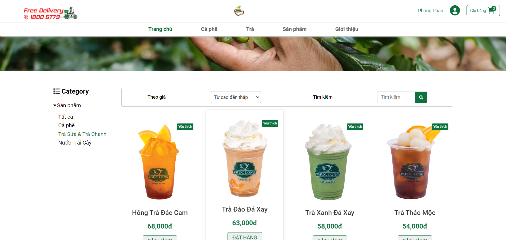
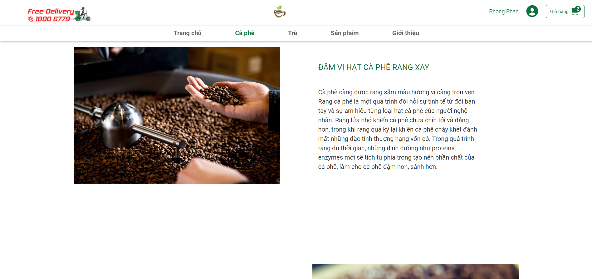
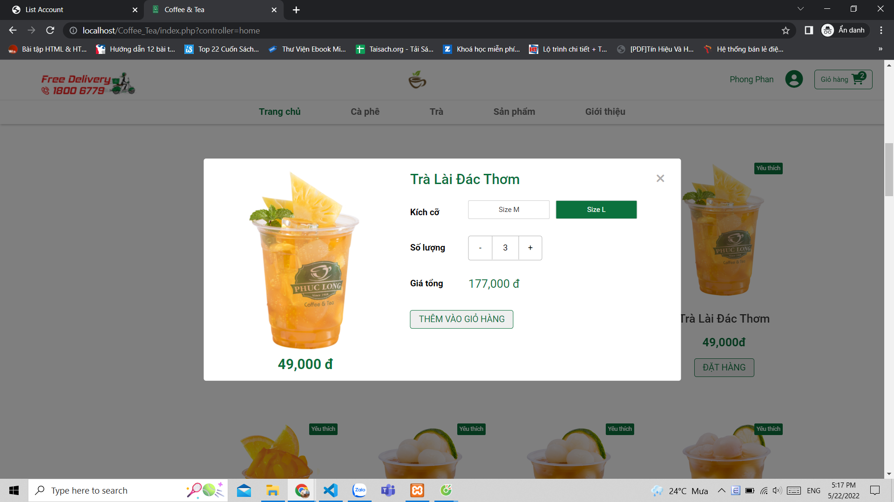
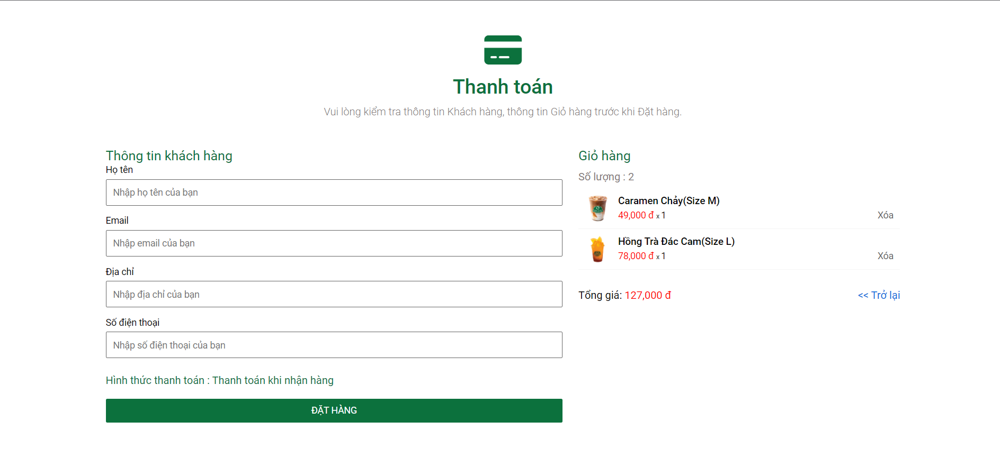
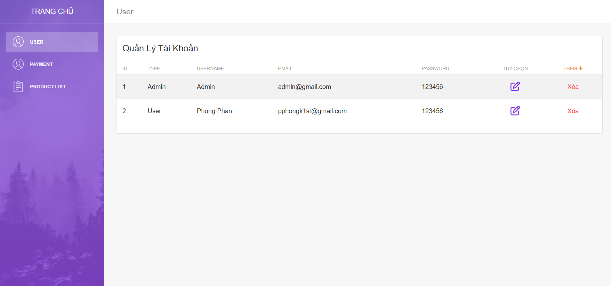
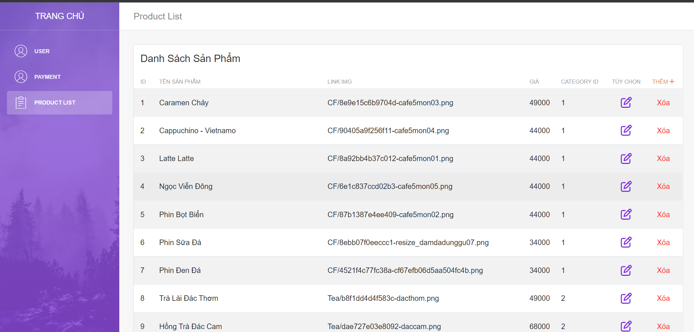

# Coffee_Tea
- Phan Văn Phong - 20020460
- Trần Văn Mạnh - 20020442

## Database

## Introduce project ##

- Language: PHP, HTML, CSS, JavaScript, jQuery
- Model: Model-View-Controller (MVC)

## Instruction ##

- Install PHP + mysql
- Import file coffee_tea.txt to create database
- Go to app/model.php to change your account to connect to database
- Done! Open website in your browser and sign up

## Demo project ##

- Login

- Home

- Coffee

- Product

- Payment

-Admin

